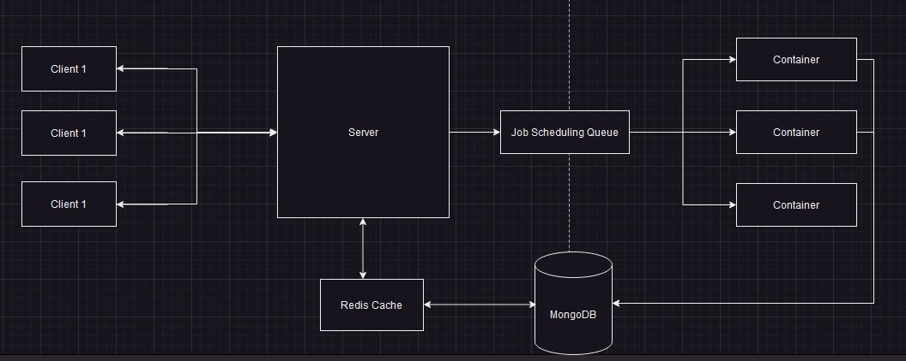

<h1 align="center">PolyIDE</h1>

<!-- description -->
## Description

PolyIDE takes inspiration from online competitive coding platforms and aims to provide a similar environment where users can easily and conveniently test their code online. By combining the power of various technologies, PolyIDE offers a user-friendly interface and a backend infrastructure capable of executing code in multiple languages.
<br />

<!-- Features -->
## Features

#### Frontend Features
- Utilizes React Ace Editor: The frontend incorporates the React Ace Editor, which provides a code editor interface with features like syntax highlighting, auto-completion, and code folding. It offers a similar look and feel to the VS Code editor.
- Customize IDE: Users can choose from multiple themes to personalize the appearance of the code editor. This allows them to select a theme that suits their preferences or provides better readability. The frontend enables users to adjust the font size of the code editor according to their comfort and readability preferences. Additionally, they can set the tab size, which affects the indentation of the code.
- Language Support: PolyIDE frontend offers support for multiple programming languages, including Python and C++. This allows users to write and execute code in their preferred language.
- Polling Concept for Output Retrieval: After submitting the code for execution, the client periodically sends requests to the server at regular intervals to check if the code execution has completed. This follows the polling concept, enabling the frontend to retrieve the output once it's available.

#### Backend Features

 - Bull Queue for Concurrent Requests: 
 To handle multiple concurrent requests from users and provide a smooth user experience, your project utilizes the Bull queue. The Bull queue manages the execution of tasks asynchronously, allowing for efficient processing of user requests.
 - Docker Container for Code Execution: For security and isolation purposes, a Docker container is created to run the code in a controlled environment. This ensures that the executed code does not interfere with the system. The Docker container provides a sandboxed execution environment for enhanced security.
 - Timeout and MaxBuffer Settings: To execute the code efficiently, the Docker environment is configured with a timeout setting. This ensures that code execution is terminated if it exceeds a specified time limit, preventing potential performance issues. Additionally, the Docker environment has a maxBuffer setting, which restricts the amount of output data that can be buffered during code execution.
 -  Redis cache is implemented to enhance the user experience during the polling process by providing fast responses.
<br />

<!-- Tech Used -->
## Technology Used
<a href="https://expressjs.com" target="_blank">  </a><a href="https://reactjs.org/" target="_blank">  </a><a href="https://nodejs.org" target="_blank">  </a>
<a href="https://www.docker.com/" target="_blank">  </a>
<a href="https://www.npmjs.com/package/bull" target="_blank">
   
</a>
<a href="https://redis.io" target="_blank">
   
</a>

<br />

<!-- Installations and Setup -->
## Installations and Setup

To run the project, you must have npm, redis and docker environment
on your local machine.

#### For backend

1. Clone the repo
   ```sh
   git clone https://github.com/ShubhDeo/polyIDE
   ```
2. Move to backend folder.
   ```sh
   cd backend
   ```
3. Install NPM packages
   ```sh
   npm install
   ```
4. Build docker images
   ```sh
   cd Dockerfiles
   ```
   ```sh
   docker build -t cpp:v1 -f DockerCpp .
   ```
   ```sh
   docker build -t python:v1 -f DockerPy .
   ```
5. Add MongoDB credentials to the .env file to connect with database. 

6. To run the server in development mode.
   ```sh
   cd backend
   ```
   ```sh
   npm run dev
   ```

#### For frontend

1. Move to the frontend folder
   ```sh
   cd frontend
   ```
2. Install NPM packages
   ```sh
   npm install
   ```
3. Run the react app
   ```sh
   npm start
   ```
<br />

<!-- design architecture -->
## System Architecture

#### Frontend Architecture

- User Interaction:
        The user lands on the web page and interacts with the PolyIDE interface.
        The user writes code in the code editor and provides input data.

- Initiating Code Execution:
The user clicks on the "Run" button to initiate the code execution process.
The client sends a POST request (/run) to the server, including the code and input data.

- Server-side Processing:
The server receives the POST request and validates the code.
If the code validation is successful, the server saves the code, input data, and necessary information (like language and job ID) in the MongoDB database with a pending status.
If the code validation fails, the server returns a failure message to the client.

- Polling for Code Status:
Upon receiving the job ID from the server, the client initiates polling.
The client sends a GET request (/status?id=) to the server at regular intervals, providing the job ID as a query parameter.
The purpose of polling is to check the status of the code execution.

- Displaying Code Output:
The server receives the GET request for status and checks the status of the code execution associated with the provided job ID.
After some time, when the code execution is completed, the server responds to the GET request with the status and output of the code execution.
The client receives the response and displays the output to the user, either as a success message or a failure message.


#### Backend Architecture
- Queue-based Job Handling:
When a user submits a code execution request, the backend utilizes a Bull queue powered by Redis.
The job request is pushed into the queue, allowing for efficient handling of multiple concurrent requests.
The user is returned a response with a pending status and a unique job ID.

- Code Validation and Job Management:
The backend performs code validation, checking for the presence of any blacklisted libraries or potential security risks. If the code passes validation, it proceeds to the next steps. Otherwise, an error message is passed to the user.
The code and input files are created in the server and are given a file ID. The fileID and the language extension is first stored in the database with a pending status and the job ID is given as a response to the user.

- Docker Container Setup and Code Execution:
An isolated Docker container is created to provide a controlled environment for code execution.
The code file and input data are transferred to the Docker container.
The code is executed within the container, which ensures security and prevents interference with the host system.

- Output Storage and Retrieval:
After code execution, the backend stores the appropriate output (success or error message) in the database, associated with the job ID.
The output can include the executed code's result or any error messages generated during execution.

- Caching Data:
 Redis cache is implemented to enhance the user experience during the polling process by providing fast responses. The cache stores the status of jobs, allowing quick retrieval and reducing the need for database queries, resulting in improved response times for users.

- Cleanup and Completion:
Once the output is stored, the input and output files are flushed to maintain data privacy.
The Docker container associated with the job is terminated, ensuring resource efficiency and preventing conflicts with subsequent executions.


<br />

<!-- outputs -->
## Results


#### Multiple Themes Options


#### Code Example


#### Syntax Error


#### Timeout Error

